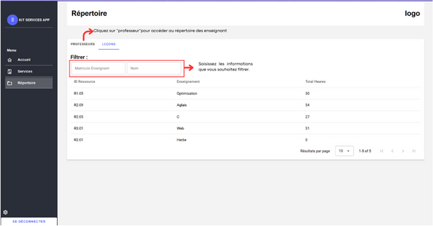

# Page Répertoire

La page Répertoire offre une vue complète et organisée de tous les cours et enseignants enregistrés. Cette partie permet de voir plus en détail ces éléments.

Vous pouvez trouver la page Répertoire en cliquant sur le texte “Répertoire” dans la barre de navigation à gauche.
Dans la partie "Leçons", il est possible de visualiser les leçons dans un tableau, de filtrer les données, ou encore de passer à la partie professeur. Pour plus d’indications, vous pouvez vous référer à l’image ci-dessous.

La seconde partie consiste à pouvoir visualiser les différents enseignants. Cette partie est semblable à celle des leçons. Cependant, il est possible d’ajouter directement un enseignant depuis cette page. Pour cela :

- Cliquez sur le bouton **Ajouter un enseignant**.
- Remplissez les différentes lignes d'information pour l’enseignant.
- Cliquez sur **Annuler** pour annuler l’enregistrement ou sur **Ajouter** pour valider la saisie.

Vous pouvez également supprimer et modifier le professeur en cliquant sur les boutons respectifs au sein de la carte de l’enseignant.