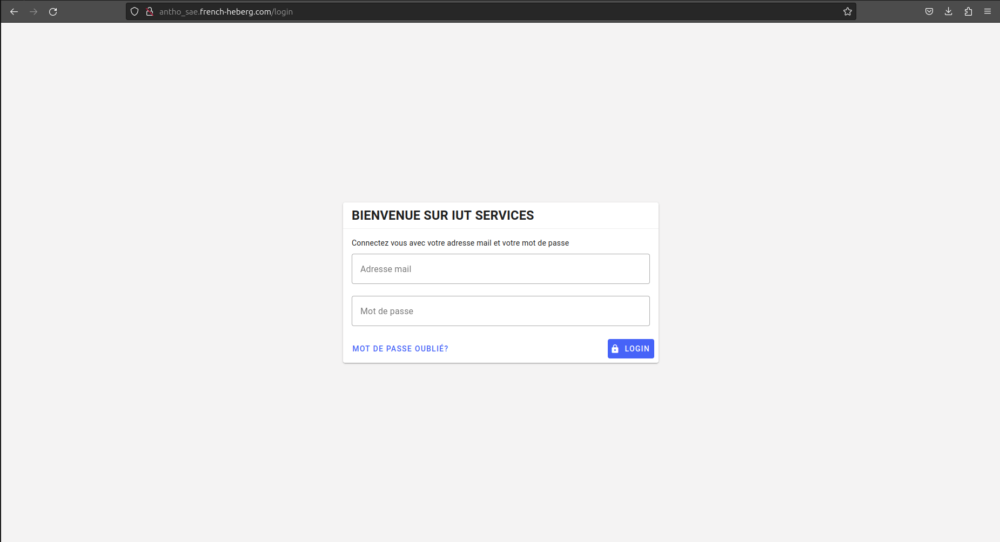

# Page Connexion

## Identifiants de connexion

Localisez la section de connexion. Vous y trouverez deux champs obligatoires:

- Adresse mail : Entrez votre adresse e-mail associée à votre compte.
- Mot de passe : Saisissez votre mot de passe. Assurez-vous de respecter la casse (majuscules et minuscules) lors de la saisie du mot de passe.

Appuyez ensuite sur le bouton Login pour vous connecter.

## Options de connexion

En fonction de votre expérience, vous pourriez rencontrer des options telles que 

!!! note "Note"
    En fonction de votre expérience, vous pourriez rencontrer des options telles que **Mot de passe oublié**. Elle vous guidera à travers le processus de récupération du mot de passe en cas d'oubli. Vous pouvez également rencontrer comme problème **Adresse mail ou mot de passe incorrect**. Dans ce cas, votre mot de passe ou adresse mail est invalide. Vérifiez vos informations et réessayez.

## Problèmes de connexion

Si vous rencontrez des problèmes pour accéder à votre compte, utilisez l'option **Mot de passe oublié** pour réinitialiser votre mot de passe. Dans la barre "Adresse mail", entrez l’adresse e-mail de votre compte puis cliquez sur **Mot de passe oublié**. Un mail vous est normalement envoyé.

## Sécurité

!!! warning "Attention"
    Votre sécurité est notre priorité. Assurez-vous de ne jamais partager vos informations de connexion avec des tiers. Si vous utilisez un ordinateur partagé, veillez à vous déconnecter après utilisation.