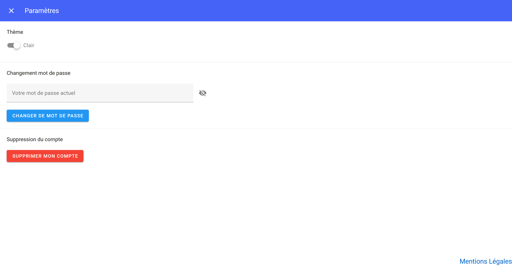

# Page paramètres
La page des paramètres est un espace dédié à la personnalisation et à la gestion de votre compte. Cette section offre la possibilité de configurer divers aspects de votre expérience utilisateur selon vos préférences et besoins spécifiques. Voici quelques fonctionnalités clés que vous pouvez trouver sur la page des paramètres :

## Theme

Personnaliser l'apparence de la plateforme en choisissant entre le thème sombre et le thème clair. Optez pour le mode qui correspond le mieux à vos préférences visuelles et à vos conditions d'utilisation. Cliquez sur le switch et choisissez le thème qui vous convient le mieux.

## Changer de mot de passe
Modification du Mot de Passe :
La sécurité de votre compte est une priorité. Vous pouvez aisément mettre à jour votre mot de passe à partir de la page des paramètres. Voici le processus étape par étape :

!!! note "Étapes a suivre"
    1. Entrez votre mot de passe actuel.
    2. Consultez votre boîte mail et cliquez sur le mail de changement de mot de passe.
    3. Cliquez sur le lien dans le mail.
    4. Entrez votre nouveau mot de passe : Sur la page de modification du mot de passe, remplissez chaque emplacement avec votre nouveau mot de passe.
    5. Finaliser le processus en cliquant sur le bouton "Valider" 

!!! Attention
    Vous disposez de seulement 5 minutes pour changer votre mot de passe. Veillez à compléter cette démarche dans le délai imparti.

## Supprimer son compte

Si vous décidez de ne plus utiliser l’application, la page des paramètres vous offre la possibilité de supprimer votre compte. 

!!! note "Étapes a suivre"
    Cliquez sur **Supprimer mon compte**
    - Cliquez ensuite sur **Oui** valider la supprésion
    - Cliquez **Non** pour annuler l'action.