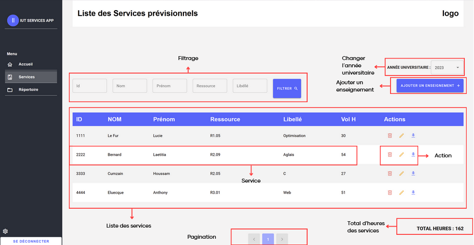

# Page des services

- La section des services est la section principale de l'application. Elle permet de visualiser les différents services des enseignants, de les créer, de les modifier ou de les supprimer selon l'année en cours. Il est possible de visualiser le total d’heures de tous les services.

Photo 2: Page Service

## Filtrage

- Les utilisateurs ont la possibilité de filtrer les services en fonction de critères spécifiques tels que l'id, le nom et prénom de l'enseignant, la ressource et le nom de la matière.

- Pour ce faire, entrez les caractéristiques voulues (Exemple: Lucie dans la case Prénom + R1.05 dans la case Ressource) ensuite cliquez sur <mark>Filter</mark>. Vous devriez voir apparaître les services filtrés.
