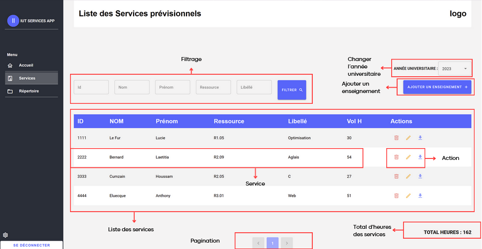
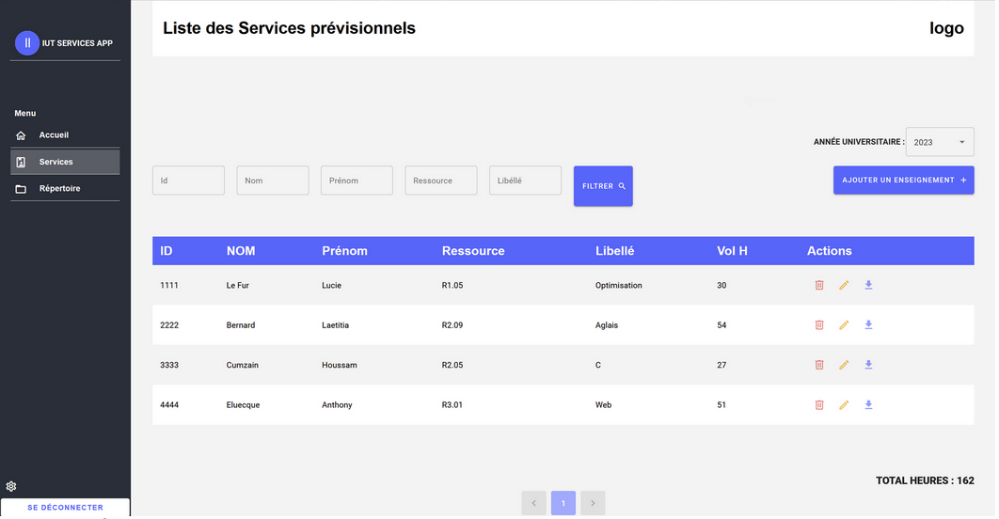
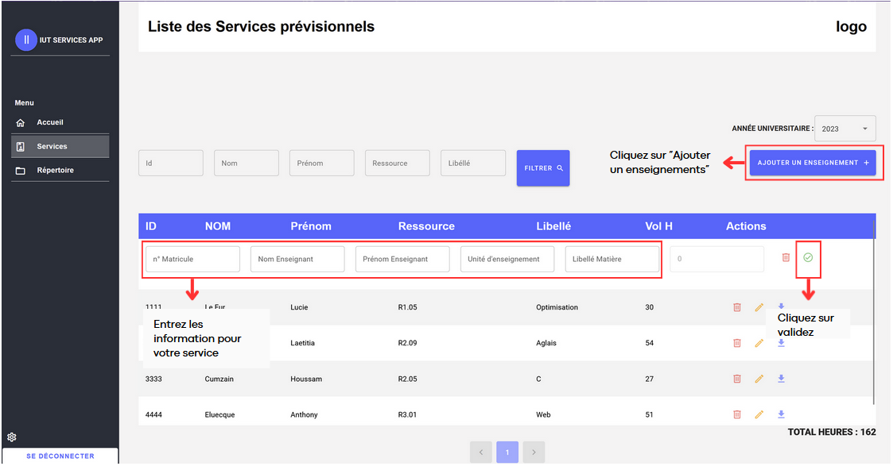

# Page des services

- La section des services est la section principale de l'application. Elle permet de visualiser les différents services des enseignants, de les créer, de les modifier ou de les supprimer selon l'année en cours. Il est possible de visualiser le total d’heures de tous les services.

_Photo 2: Page Service_

## Filtrage

- Les utilisateurs ont la possibilité de filtrer les services en fonction de critères spécifiques tels que l'id, le nom et prénom de l'enseignant, la ressource et le nom de la matière.

- Pour ce faire, entrez les caractéristiques voulues (Exemple: Lucie dans la case Prénom + R1.05 dans la case Ressource) ensuite cliquez sur  **Filtrer**. Vous devriez voir apparaître les services filtrés.

_Photo 3: Page Service_

## Changer l'année universitaire :

- Si vous voulez voir vos services pour une année universitaire différente, vous pouvez facilement changer l'année. Il vous suffit de cliquer sur la flèche à côté de l'année en cours pour faire apparaître une liste déroulante des années disponibles. Sélectionnez l'année souhaitée en cliquant dessus.

## Liste des services :

- Sur cette page, vous pouvez voir tous les enseignements précédemment créés de l'année choisie.

## Pagination :

- La pagination est essentielle pour naviguer correctement sur l’application. En effet, la pagination permet de diviser la liste des services en différentes pages afin de faciliter une meilleure utilisation. Pour naviguer dans la liste des services, cliquez sur les différents chiffres pour aller d’une page à l’autre.

## Ajouter un enseignement :

- Il est possible d'ajouter un enseignement (un service) à la liste des services pour l'année choisie. Cela va ouvrir un formulaire dans le tableau afin que l'utilisateur puisse remplir tous les éléments d'un enseignement.

!!! note "Ajouter un enseignement"

    1. Vérifiez bien que l’année universitaire est bien celle dans laquelle vous voulez créer votre service.
    2. Cliquez sur  **Ajouter un enseignement**.
    3. Remplissez les cases vides apparues dans la liste des services avec les informations voulues.
    4. Cliquez sur ✅

Le service maintenant créé apparaît dans la liste des services.

_Photo 4: Ajouter un enseignement_